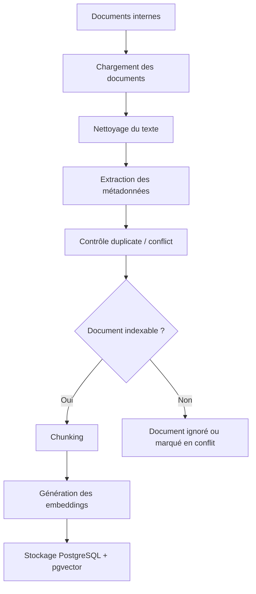
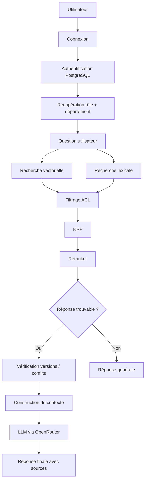

# NovaTech RAG Workflow

## 1. Indexing workflow

```mermaid
flowchart TD
    A[Documents internes] --> B[Chargement des documents]
    B --> C[Nettoyage du texte]
    C --> D[Extraction des métadonnées]
    D --> E[Contrôle duplicate / conflict]
    E --> F{Document indexable ?}
    F -->|Oui| G[Chunking]
    G --> H[Génération des embeddings]
    H --> I[Stockage PostgreSQL + pgvector]
    F -->|Non| J[Document ignoré ou marqué en conflit]
```

## 2. Query workflow

```mermaid
flowchart TD
    A[Utilisateur] --> B[Connexion]
    B --> C[Authentification PostgreSQL]
    C --> D[Récupération rôle + département]
    D --> E[Question utilisateur]
    E --> F[Recherche vectorielle]
    E --> G[Recherche lexicale]
    F --> H[Filtrage ACL]
    G --> H
    H --> I[RRF]
    I --> J[Reranker]
    J --> K{Réponse trouvable ?}
    K -->|Oui| L[Vérification versions / conflits]
    L --> M[Construction du contexte]
    M --> N[LLM via OpenRouter]
    N --> O[Réponse finale avec sources]
    K -->|Non| P[Réponse générale]
```